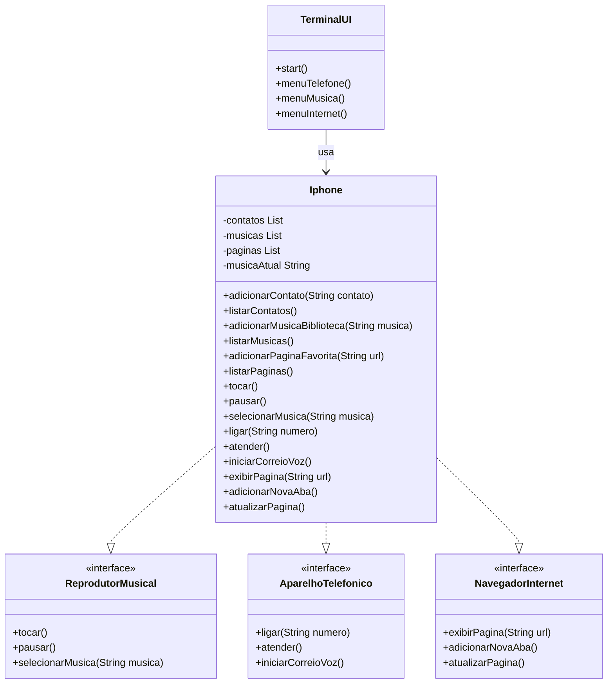

# iPhone – Desafio POO (DIO)

Este repositório contém a solução do desafio de Programação Orientada a Objetos (POO) proposto pela DIO para modelar um componente **iPhone** com as funcionalidades de Reprodutor Musical, Aparelho Telefônico e Navegador na Internet.

## Fonte do Diagrama (Mermaid)



## Como compilar e executar o projeto
```bash
REM 1) Cria a pasta de saída (caso ainda não exista)
mkdir bin

REM 2) Compila todos os arquivos .java da pasta src colocando os .class em bin
javac -d bin src/*.java

REM 3) Executa a aplicação a partir da pasta bin
java -cp bin Main
```

## Uso

Ao iniciar o programa você verá no terminal uma representação em ASCII de um iPhone com três "aplicativos" e um botão **Sair**:

```
  +-------------------------------+
  |           iPhone              |
  |-------------------------------|
  |  +---+    +---+    +---+      |
  |  | 1 |    | 2 |    | 3 |      |
  |  +---+    +---+    +---+      |
  |  Tel      Música   Safari     |
  |                               |
  |            +---+              |
  |            | 0 |              |
  |            +---+              |
  |             Sair              |
  +-------------------------------+
```

Digite o número correspondente para abrir o respectivo aplicativo:

* `1` **Telefone** – permite:
  * `1` Ligar para um número
  * `2` Atender (simulado)
  * `3` Iniciar correio de voz
  * `4` Ver contatos salvos

* `2` **Música** – permite:
  * `1` Selecionar uma música (ela é adicionada à biblioteca)
  * `2` Tocar a música selecionada
  * `3` Pausar
  * `4` Ver biblioteca de músicas

* `3` **Safari** – permite:
  * `1` Exibir uma página (a URL é adicionada aos favoritos)
  * `2` Abrir nova aba (simulado)
  * `3` Atualizar página
  * `4` Favoritos (lista de páginas salvas)

Em qualquer sub-menu digite `0` para voltar; na tela inicial digite `0` para encerrar o programa.