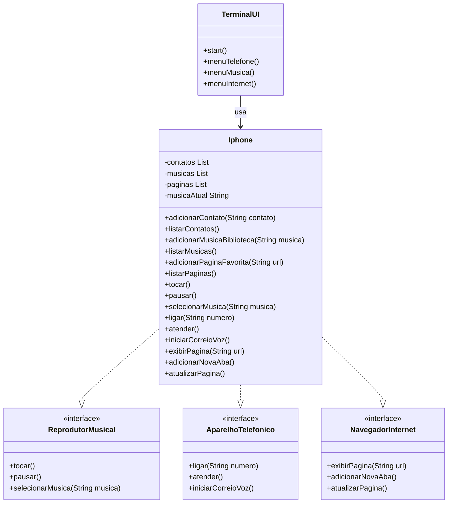

# iPhone – Desafio POO (DIO)

Este repositório contém a solução do desafio de Programação Orientada a Objetos (POO) proposto pela DIO para modelar um componente **iPhone** com as funcionalidades de Reprodutor Musical, Aparelho Telefônico e Navegador na Internet.

## Fonte do Diagrama (Mermaid)



## Como compilar e executar o projeto
```bash
REM 1) Cria a pasta de saída (caso ainda não exista)
mkdir bin

REM 2) Compila todos os arquivos .java da pasta src colocando os .class em bin
javac -d bin src/*.java

REM 3) Executa a aplicação a partir da pasta bin
java -cp bin Main
```